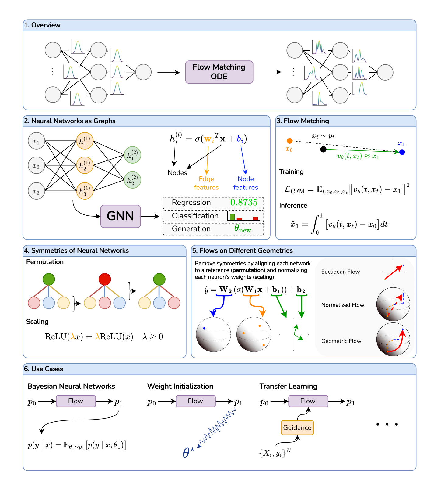

# Geometric Flow Models over Neural Network Weights 

Informatics MSc Thesis @ TUM 

[Click to view the PDF](https://erdogan.dev/thesis.pdf)

**Abstract**

> Deep generative models such as flow and diffusion models have proven to be effective in modeling high-dimensional and complex data types such as videos or proteins, and this has motivated their use in different data modalities, such as neural network weights. A generative model of neural network weights would be useful for a diverse set of applications, such as Bayesian deep learning, learned optimization, and transfer learning. However, the existing work on weight-space generative models often ignores the symmetries of neural network weights, or only takes into account a subset of them. Modeling those symmetries, such as permutation symmetries between subsequent layers in an MLP, the filters in a convolutional network, or scaling symmetries arising with the use of non-linear activations, holds the potential to make weight-space generative modeling more efficient by effectively reducing the dimensionality of the problem. 
> 
> In this light, we aim to design generative models in weight-space that more comprehensively respect the symmetries of neural network weights. We build on recent work on generative modeling with flow matching, and weight-space graph neural networks to design three different weight-space flows. Each of our flows takes a different approach to modeling the geometry of neural network weights, and thus allows us to explore the design space of weight-space flows in a principled way. Our results confirm that modeling the geometry of neural networks more faithfully leads to more effective flow models that can generalize to different tasks and architectures, and we show that while our flows obtain competitive performance with orders of magnitude fewer parameters than previous work, they can be further improved by scaling them up. We conclude by listing potential directions for future work on weight-space generative models.



## Cite

If you want to refer to our work, please cite it as
```
@mastersthesis{erdogan2025geometric,
    author = {Erdogan, Ege},
    title = {Geometric Flow Models over Neural Network Weights},
    school = {Technical University of Munich},
    year = {2025},
    type = {Master's thesis}    
}
```